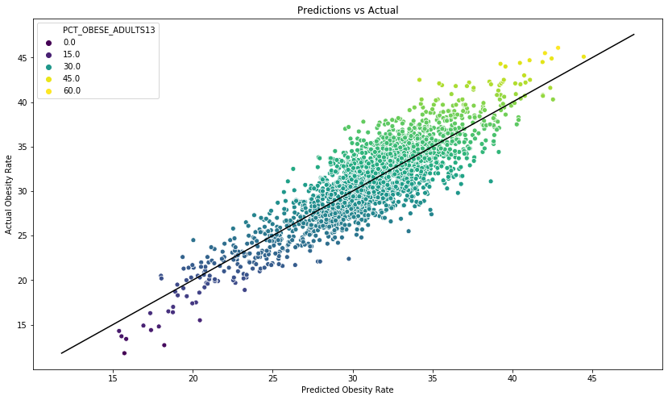

# Predicting-Obesity-Rate-Based-on-Food-Atlas

## Contents
- [Problem Statement](#Problem-Statement)
- [Executive Summary](#Executive-Summary)
- [Data Dictionary](#Data-Dictionary)
- [Preprocessing](#Preprocessing)
- [Modelling](#Modelling)
- [Conclusions and Recommendations](#Conclusions-and-Recommendations)

## Problem Statement

More than one-third of adults and 18.5% of children are obese. Increasing the access to healthy foods have been in the forefront of policymakers agenda in order to address this worldwide problem. The question we am seeking to answer is whether the number of healthy food stores available in each county can predict the obesity rate. We found data on food deserts from the United States Department of Agriculture. In order to see the relationships between a person's food environment and obesity, the data set consists of the availability of the number of grocery stores, fast food restaurants, and full-service restaurants. Look at which observations have the greatest impact on obesity rates. The data also puts into account the number of households without cars and are more than a mile away from grocery stores. The data consists of 3,139 observations. The number of grocery stores, full service restaurants and fast food restaurants were calculated for each county. 

## Data Dictionary 

[data dictionary](https://www.ers.usda.gov/data-products/food-access-research-atlas/download-the-data/)

|File name| Description|
|---|---|
|[Acess to Food and Stores](./Data/Acess_food.xlsx)| Store/restaurant proximity, food prices, food and nutrition assistance programs, and community characteristics|
|[Local](./Data/DataDownloadfull.xls)|The number of farms in the county that sell at least some products directly to final consumers. This includes sales from roadside stands, farmers markets, pick-your-own, door-to-door.|
|[Health](./Data/DataDownloadfull.xls)| The number of "fitness and recreation centers" in a county, adults and children who have self-reported participating in any kind of physical activity that increased their heart rate and made them breathe hard some of the time for a total of at least 60 minutes per day on each of the 7 days before the survey.|
|[Life Expectancy](./Data/Life_Expectancy.xlsx)|Male and Female life expectancy from 1985 to 2010. |
|[Obesity](./Data/Obesity.xlsx)| Obesity rates and Diabete rates among children in 2008 and 2013.|

## Executive Summary

A food atlas or a “food desert” is an area with limited access to affordable and healthy food. It hard for Americans to eat a healthy diet when they don’t have access to healthy food, and this is a main reason why we still have high obesity rates in many parts of the country. The rate of diabetes among Americans has more than doubled (Ghosh-Dastidat & D. Cohen & G. Hunter & S. N. Zenk & C. Huang & R. Beckman & T. Dubowitz, 2014).  The increases of supermarkets that are a half a mile distance from households have resulted in a lower BMI. A person’s food environment can greatly affect obesity rates in the U.S.  People living in low-income neighborhoods have poorer health and higher rates of obesity (Ghosh-Dastidat et al, 2014). The distance to restaurants, fast food restaurants and grocery stores can impact your eating choices. We seeks to show how your food environment can help determine obesity rates for each county in all fifty states of the U.S. We believe that the number of unhealthy food option will cause an increase the obesity levels in the county. Counties with access to healthier food choices will have a negative correlation with obesity rates. 

Obesity is still a major problem in the United States. Although, we have a better understanding on what is considered a healthy diet, many Americans don’t have access to affordable and healthy food. Americans are also choosing not to follow a healthy lifestyle because of the increased price of the food items. Lower-income households are relying more on “empty calorie” food that are readily available at convenience stores and fast food restaurants (R.E. Walker & Jason Block & Ichiro Kawachi, 2010). The U.S. Office of Agriculture found that 2.3 million people live more than a mile from the grocery store and don’t own a car (R.E. Walker et al, 2010). It is also difficult for large supermarkets to find enough space to build their store in urban areas. As a result, the creation of more supermarkets and grocery stores are seen as undesirable (Chi, Sang-Hyun & Diana S. Grigsby-Toussaint & Natalie Bradford & Jinmu Choi, 2013). In more rural areas, people lack pubic transportation and the number of grocery stores is growing at a much smaller rate as compared to the rate of fast food restaurants. Philadelphia had the second lowest number of supermarkets among other U.S. major cities and lower income neighborhood at thirty percent less food stores than higher income neighborhoods (R.E. Walker et al, 2010). The emergence of food deserts came with more upper class households leaving the cities to go to the suburban areas (R.E. Walker & Jason Block & Ichiro Kawachi, 2010). Studies have found that obesity stems from unhealthy eating habits. Americans have limited access to adequate food and people are at risk for food insecurity and obesity (Ghosh-Dastidat et al, 2014). The U.S. has one of the highest rates in food insecurity when compared to other countries. In order to combat obesity, we need to make is a priority that everyone has equal access to affordable and healthier food choices. A healthy food environment refers to having easy access to supermarkets, farmers markets and convenience stores.
 
## EDA and Modelling

The version of the Food Environment Atlas we looked at had over _ variables, including new indicators on access and proximity to a grocery store for sub populations; an indicator on the SNAP Combined Application Project for recipients of Supplemental Security Income (at the State level); and indicators on farmers' markets that report direct selling of their produce. 

Before running the model, we checked collinearity between the features so that the model would have a better score and accurate prediction and removed any columns that contained a lot of null values that we were not able to fill with outside research. We also conducted a Random Forest model to see which variables had the highest importance score. The features with the highest score were the percent of local farms, the count of grocery stores, the count of SNAPS-Authorized stores and the count of WICS Authorized stores. 

Once the data is cleaned and the collinearity and the important features were analyzed, we ran a linear regression, lasso, ridge and PCA model to find the most important features and answer our problem statement.  The obesity rates were between 1-60 so a linear model made the more sense as opposed to running a logistic regression model.  The first linear regression model contained all features and as a result extremely over fit with a training score of .92 and testing score of .12. The features that had a correlation above .1 with Obesity rates were used as the predictors in the next linear regression model. As a result, the model had an R2 for the training test of .75 and an R2 of .73 for the testing set. Then we ran a linear regression model with the Random Forest features, the training score was .92 and the testing score was .59. This was also very overfit and in order to fix this, we ran a lasso and ridge model. After running the lasso model, the r2 was .77  for the training set and .75 for the testing set. The Ridge model, suffered from overfitting with a training and testing score of .914 and .67, respectively. The PCA model has a training score of .67 and .63. The most accurate model was Lasso with the top important features with a training and testing score _ and a RMSE score of _ and _ . 

The features that had the highest added value to  obesity rate were . The linear regression coefficients for those features were, respectively. An increase in _ will increase obesity _, all else remaning constant. 

### Model Features 

| Name                  | Description                                      |
|-----------------------|--------------------------------------------------|
| PCT_DIABETS_ADULTS08  | Adult diabetes rate in 2008                      |
| PCT_DIABETES_ADULTS13 | Adult Diabetes rate in 2013                      |
| RECFAC09              | Number of fitness facilities                     |
| GROC09                | Count of grocery stores                          |
| SUPERC                | Number of superstores                            |
| SNAPS12               | SNAP-Authorized stores                           |
| WICS12                | WIC-authorized stores                            |
| LACCESS_POP10         | Count of population- low access to store         |
| PCT_LACCESS_POP10     | Percent of population - low access to store      |
| LACCESS_LOWI10        | Low income and low access to store, 2010         |
| PCT_LACCESS_LOWI10    | Percent Low income and low access to store, 2010 |
| LACCESS_HHNV10        | Households, no car & low access to store, 2010   |
| PCT_LACCESS_HHNV10    | Percent of households no car and low access      |
| LACCESS_CHILD10       | Child Low Access to Car                          |
| SNAPSPTH12            | SNAP-authorized stores/1,000 pop                 |
| GHVEG_FARMS07         | Greenhouse vegetable and fresh herb farms        |
| FMRKT09               | Number of Farmer's Markets                       |
| SPECS09               | Number of Specialty Stores                       |
| CONVS09               | Number of Convenience Stores                     |
| PCT_LOCLFARM07        | Farms with direct sales                          |                                                      

### Model Scores 

|Model                   | Train  Score    | Test score     | RMSE              |  
|------------------------|-----------------|----------------|-------------------|
| Baseline               |                 |                |                   |
| Linear Regression      |                 |                |                   | 
| Lasso                  |                 |                |                   |      
| Ridge                  |                 |                |                   |       
| PCA                    |                 |                |                   |   

## Conclusions and Recommendations

This analysis showed how access to stores and well as the number of food stores and local food could impact obesity rates among adults and found that there is a statistically significant relationship between the number of fast food restaurants and obesity among children and adults. However, the RMSE scores were not very low so the model did not represent strong evidence that these factors were the only variables affecting obesity. In the U.S., healthier food items tend to be a lot more expensive than the unhealthy food items. As result, even if the counties had a lot of grocery stores or farmers market and easy access to healthier foods, a low-income household will choose the cheapest option and ignore the health consequences. The region of the U.S. is also very important factor that accounts for the obesity levels. Some counties had a small number of grocery stores and access to healthy food options, and many households do not have access to a car. The lack of access to supermarkets has a greater chance of health challenges such as diabetes, heart disease and cancer. Unhealthy food may be a lot cheaper in the short run but there is significant evidence that unhealthy eating will lead to diabetes, cardiovascular disease and other life threatening diseases. The consequences in the long run are a lot worse. In order to end obesity in the U.S., we need to make the healthier food options more affordable and transportation more available. If we were to conduct this study again, we would want to look at prices of the food items and make interaction terms with the price variables and the stores variables. Prices have a lot of impact on what Americans choose to eat. Therefore, the regression with food prices might have a higher score and show a stronger relationship to the obesity rate in adults. It would also interesting to look at median income for different counties and obesity rate. 

## Sources 

Walker, Renee E., Jason Block, and Ichiro Kawachi. "Do Residents of Food Deserts Express Different Food Buying Preferences Compared to Residents of Food Oases? A Mixed-methods Analysis." N.p., 10 Apr. 2012. Web.

Ghosh-Dastidar, B., D. Cohen, G. Hunter, S. N. Zenk, C. Huang, R. Beckman, and T. Dubowitz. "Distance to Store, Food Prices, and Obesity in Urban Food Deserts." N.p., Nov. 2014. Web.

Powell, Lisa M., Sandy Slater, Donka Mirtcheva, Yanjun Bao, and Frank J. Chaloupk. "Food Store Availability and Neighborhood Characteristics in the United States." N.p., 25 Sept. 2006. Web